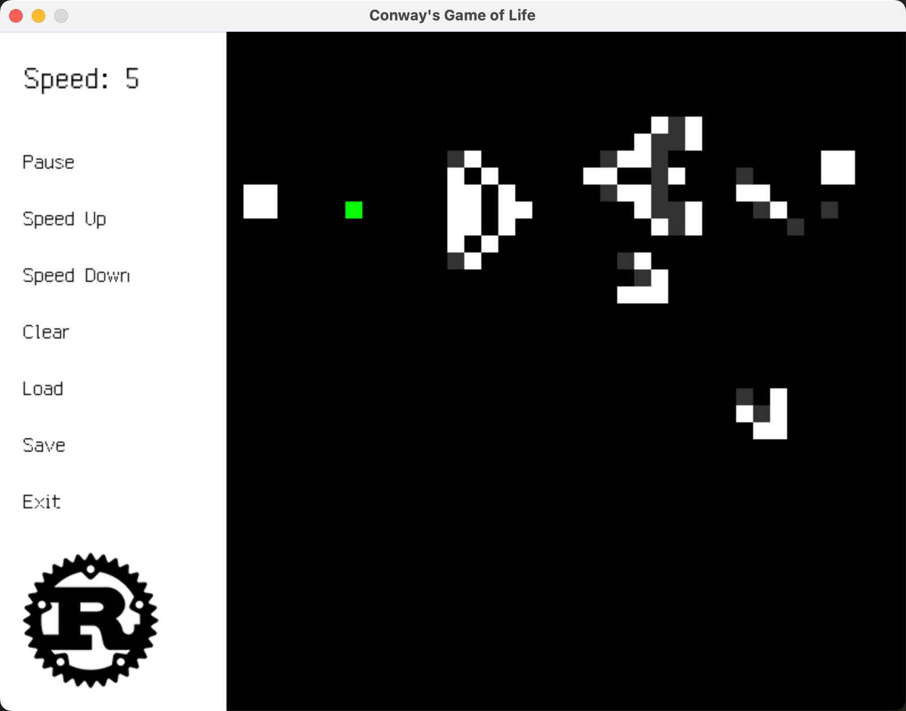

# Conway's Game of Life in Rust!


## Features

- Supports periodic boundary conditions.
- Supports custom board size.
- Supports load and save board state from/to file.
- Supports speed control.
- Supports pause and resume.
- And more...

## How to Run
> Note: MSVC toolchain is required under Windows.
```shell
cargo install cargo-vcpkg
cargo vcpkg build
cargo run
```

### Usage
```
Conway's Game of Life in Rust!

Usage: conway-rs [OPTIONS]

Options:
  -W, --width <WIDTH>    The width of the board [default: 32]
  -H, --height <HEIGHT>  The height of the board [default: 32]
  -p, --periodic         Enable periodic boundary conditions
  -h, --help             Print help
  -V, --version          Print version
```